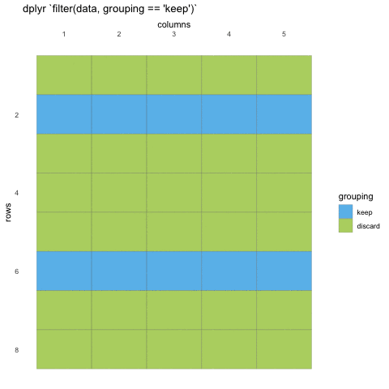

layout: true
    
<div class="my-sidebar"></div> 

---

```{r setup, include=FALSE}
knitr::opts_chunk$set(echo = TRUE, 
                      message = FALSE, 
                      error = FALSE, 
                      warning = FALSE)

# These are the defaults
xaringanExtra::use_extra_styles(
  hover_code_line = TRUE,         #<<
  mute_unhighlighted_code = TRUE  #<<
)

library(knitr)
library(tidyquintro)
```


class: dark, center
background-image: url(img/ggplot2.png), url(img/dplyr.png), url(img/pipe.png)
background-size: 15%
background-position: 32% 65%, 50% 65%, 68% 65%

# Part 1 

## Tidy data wrangling


---
class: middle, inverse

## Tidy data wrangling 
<ul style="color: white;">
  - **plotting data with [ggplot2](https://ggplot2.tidyverse.org/) (~25 min)** 
  - **sub-setting data with [dplyr](https://dplyr.tidyverse.org/) (~25 min)**  
  - **chaining commands with the pipe `%>%` (~10 min)**  
  - **adding and altering variables with [dplyr](https://dplyr.tidyverse.org/) (~25 min)**  


---
background-image: url(img/ggplot2.png)
background-size: 8%
background-position: 95% 5%

# ggplot2
## grammar of graphics


---
background-image: url(img/ggplot2.png)
background-size: 8%
background-position: 95% 5%
## ggplot2 setting

.pull-left[
```{r "penguin-plot2", eval = FALSE}
ggplot(data = penguins,
       mapping = aes(x = bill_length_mm)) +
  geom_histogram(
    fill = "forestgreen" #<<
  )
```
]

.pull-right[
```{r "penguin-plot2-rend", echo = FALSE, ref.label="penguin-plot2"}
```
]

---
background-image: url(img/ggplot2.png)
background-size: 8%
background-position: 95% 5%
## ggplot2 mapping

.pull-left[
```{r "penguin-plot3", eval = FALSE}
ggplot(data = penguins,
       mapping = aes(x = bill_length_mm,
                     fill = species)) + #<<
  geom_histogram( )
```
]

.pull-right[
```{r "penguin-plot3-rend", echo = FALSE, ref.label="penguin-plot3"}
```
]

---
class: inverse, middle, center

## Go to RStudio 
### live demo

---
class: inverse, middle, center

## Go to plotting exercises 
### `learnr::run_tutorial("001-plotting", "tidyquintro")` 

---
class: dark, middle, center
background-image: url(img/dplyr.png)
background-size: 15% 
background-position: 50% 95%

# dplyr
## data subsetting

---
background-image: url(img/dplyr.png)
background-size: 8%
background-position: 95% 5%

# dplyr
## grammar of data manipulation

provides a consistent set of verbs that help you solve the most common data manipulation challenges:

<div style="background-color: #94c11faa;">
`select()` picks variables based on their names.   
`filter()` picks cases based on their values. 
</div>
`mutate()` -  adds or alters variables that are functions of existing variables  
`summarise()` reduces multiple values down to a single summary.  
`arrange()` changes the ordering of the rows.  

---
background-image: url(img/dplyr.png)
background-size: 8%
background-position: 95% 5%

# dplyr

.pull-left[
### `filter()` - subsetting rows

Reducing the number of rows in a data sat based on
some logic.

- `filter()` evaluates a statement to be logical (`TRUE` or `FALSE`)  
]

--

.pull-right[
```{r, echo = FALSE}

```
]

---
background-image: url(img/dplyr.png)
background-size: 8%
background-position: 95% 5%

## dplyr - comparison to base-R

#### tidy
```{r, eval = FALSE}
filter(penguins, bill_length_mm > 40)
```


#### base
```{r, eval = FALSE}
penguins[penguins$bill_length_mm > 40, ]

# or
subset(penguins, bill_length_mm > 40)
```


<div style="font-size: 15px;">
<a href="https://dplyr.tidyverse.org/articles/base.html">https://dplyr.tidyverse.org/articles/base.html</a>
</div>

---
class: inverse, middle, center

## Go to RStudio
### live demo

---
background-image: url(img/dplyr.png)
background-size: 8%
background-position: 95% 5%

# dplyr

.pull-left[
### `select()` - reduce columns

Reducing the number of columns (or rearranging columns)
Can be used with column names, index integer, or tidyselect-functions

tidy-select helpers
   - `ends_with("string")` - column names ending with "string"  
   - `starts_with("string")` - column names starting with "string"  
   - `contains("string")` - column names containing "string"  
]
 
--

.pull-right[
```{r, echo = FALSE}
knitr::include_graphics("gifs/selecting.gif")
```
]


---
background-image: url(img/dplyr.png)
background-size: 8%
background-position: 95% 5%

## dplyr - comparison to base-R

#### tidy
```{r, eval = FALSE}
select(penguins, species, island, ends_with("mm"))
```


#### base
```{r, eval = FALSE}
penguins[c(1, 2, grep("mm$", names(penguins)))]

# or
subset(penguins, select = c("species", "island", "bill_length_mm", "bill_depth_mm", "flipper_length_mm"))
```


<div style="font-size: 15px;">
<a href="https://dplyr.tidyverse.org/articles/base.html">https://dplyr.tidyverse.org/articles/base.html</a>
</div>

---
class: inverse, middle, center

## Go to RStudio
### live demo

---
class: inverse, middle, center

## Go to subsetting exercises 
### `learnr::run_tutorial("002-subsetting", "tidyquintro")` 

---
class: dark, center
background-image: url(img/pipe.png)
background-size: 15% 
background-position: 50% 65%

## magrittr
### the pipe - chaining commands

---
background-image: url(img/pipe.png)
background-size: 8%
background-position: 95% 5%

### the pipe - chaining commands

- Common to many programming languages  
   - sending the output from one function, straight into another, without saving the intermediary  

- Only really work when input is the _first_ command to a function  
   - This is not the case for most base-R functions, but is _always_ the case with tidyverse functions  

- The common used pipe in R, `%>%`, originally comes from the magrittr package, but also comes with dplyr   

???
arguably, in tidyverse the chaining of commands is one of the things that makes it most powerful. 
Chaining commands is a common programming concept, where you send the output of one command directly into another, without saving the intermediary. 
This saves you from overcrowding your workspace with lots of new objects you will never use. 
It is commonly referred to as a "pipe" and in R the common pipe is %>% 


---
background-image: url(img/pipe.png)
background-size: 8%
background-position: 95% 5%

### Use

.pull-left[
```{r "pipe1", eval = FALSE}
# standard
select(penguins, 
       species, island, ends_with("mm"))
```

```{r, eval = FALSE}
# piped
penguins %>% 
  select(species, island, ends_with("mm"))
```
]

.pull-right[
```{r "pipe1-rend", ref.label="pipe1", echo = FALSE}
```
]

---
background-image: url(img/pipe.png)
background-size: 8%
background-position: 95% 5%

### Use

.pull-left[
```{r "pipe2", eval = FALSE}
penguins %>% 
  select(species, island, 
         starts_with("bill")) %>% 
  filter(island == "Dream")
```

]

.pull-right[
```{r "pipe2-rend", ref.label="pipe2", echo = FALSE}
```
]

---
background-image: url(img/pipe.png)
background-size: 8%
background-position: 95% 5%

### Use

.pull-left[
```{r "pipe3", eval = FALSE}
penguins %>% 
  select(species, island, 
         starts_with("bill")) %>% 
  filter(island == "Dream") %>% 
  
  ggplot(aes(species, bill_length_mm)) + 
  geom_violin(aes(fill = species)) +
  scale_fill_viridis_d(alpha = .7)
```

]

.pull-right[
```{r "pipe3-rend", ref.label="pipe3", echo = FALSE}
```
]

---
class: inverse, middle, center

## Go to RStudio
### live demo

---
class: inverse, middle, center

## Go to chaining exercises 
### `learnr::run_tutorial("003-chaining", "tidyquintro")` 

---
class: dark, center
background-image: url(img/dplyr.png)
background-size: 15% 
background-position: 50% 65%

## dplyr
### data wrangling / manipulation

---
background-image: url(img/dplyr.png)
background-size: 8%
background-position: 95% 5%

# dplyr
## grammar of data manipulation

provides a consistent set of verbs that help you solve the most common data manipulation challenges:


`select()` picks variables based on their names.   
`filter()` picks cases based on their values. 
<div style="background-color: #94c11faa;">
`mutate()` -  adds or alters variables that are functions of existing variables  
</div>
`summarise()` reduces multiple values down to a single summary.  
`arrange()` changes the ordering of the rows.  

---
background-image: url(img/dplyr.png)
background-size: 8%
background-position: 95% 5%

## dplyr - comparison to base-R

#### tidy
```{r, eval = FALSE}
penguins %>% 
  mutate( 
    new_column = 1,
    bill_ld_ratio = bill_length_mm/bill_depth_mm
  )
```


#### base
```{r, eval = FALSE}
penguins$new_column <- 1
penguins$bill_ld_ratio <- penguins$bill_length_mm/penguins$bill_depth_mm
```


<div style="font-size: 15px;">
<a href="https://dplyr.tidyverse.org/articles/base.html">https://dplyr.tidyverse.org/articles/base.html</a>
</div>

---
background-image: url(img/dplyr.png)
background-size: 8%
background-position: 95% 5%

## Adding new variables

```{r}
penguins %>% 
  mutate( new_column = 1,
    bill_ld_ratio = bill_length_mm/bill_depth_mm)
```

---
background-image: url(img/dplyr.png)
background-size: 8%
background-position: 95% 5%

## dplyr - across many columns 

```{r "dplyr-across"}
penguins %>% mutate(across(ends_with("mm"), ~ .x/10))
```

---
background-image: url(img/dplyr.png)
background-size: 8%
background-position: 95% 5%

## dplyr - across many columns 

```{r "dplyr-across2"}
penguins %>% mutate(across(ends_with("mm"), ~ .x/10, 
                           .names = "{str_replace(.col, 'mm', 'cm')}") #<<
                    ) %>% 
  select(1:3, contains("bill"))
```


---
background-image: url(img/dplyr.png)
background-size: 8%
background-position: 95% 5%

## dplyr - grouped

```{r "dplyr-group1"}
penguins %>% 
  group_by(species) %>% 
  mutate(
    bill_length_sp_max = max(bill_length_mm, na.rm = TRUE), #<<
    bill_length_pc = (bill_length_mm/bill_length_sp_max)*100 #<<
    ) %>% 
  select(1:3, contains("bill"))
```

---
class: inverse, middle, center

## Go to RStudio
### live demo

---
class: inverse, middle, center

## Go to mutating exercises 
### `learnr::run_tutorial("004-mutating", "tidyquintro")` 

---
class: dark, middle, center

# End or part 1
## 30 minute lunch break

