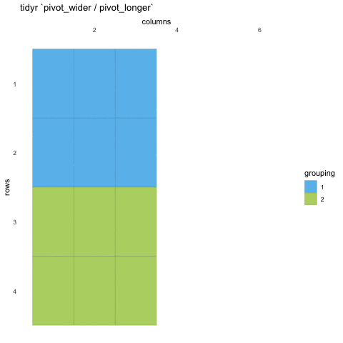

layout: true
    
<div class="my-sidebar"></div> 

---

```{r setup, include=FALSE}
knitr::opts_chunk$set(echo = TRUE, 
                      message = FALSE, 
                      error = FALSE, 
                      warning = FALSE)

# These are the defaults
xaringanExtra::use_extra_styles(
  hover_code_line = TRUE,         #<<
  mute_unhighlighted_code = TRUE  #<<
)

library(knitr)
library(tidyquintro)
library(countdown)
```

class: dark, center
background-image: url(img/tidyr.png), url(img/dplyr.png), url(img/purrr.png)
background-size: 15%
background-position: 32% 65%, 50% 65%, 68% 65%

# Part 2 

## Tidy data reshaping & summaries

---
class: middle, inverse

## Tidy data reshaping & summaries
<ul style="color: white;">
  - pivoting data with [tidyr](https://tidyr.tidyverse.org/) (~25 min) 
  - grouped summaries with [dplyr](https://dplyr.tidyverse.org/) (~25 min)  
  - working with nested data using [purrr](https://purrr.tidyverse.org/) (~25 min) 
  
---
class: dark, center
background-image: url(img/tidyr.png)
background-size: 15% 
background-position: 50% 65%

# tidyr
## pivoting / altering data shape


---
background-image: url(img/tidyr.png)
background-size: 8%
background-position: 95% 5%

## tidyr
The goal of tidyr is to help you create tidy data. 

Tidy data is data where:

- Every column is variable.  
- Every row is an observation.  
- Every cell is a single value.  

Tidy data describes a standard way of storing data that is used wherever possible throughout the tidyverse. 
If you ensure that your data is tidy, you’ll spend less time fighting with the tools and more time working on your analysis. Learn more about tidy data in `vignette("tidy-data")`.

---
background-image: url(img/tidyr.png)
background-size: 8%
background-position: 95% 5%

### Tall/long vs. wide data

- Tall (or long) data are considered "tidy", in that they adhere to the three tidy-data principles  

- Wide data are not necessarily "messy", but have a shape less ideal for easy handling in the tidyverse  

Example in longitudinal data design:

- wide data: each participant has a single row of data, with all longitudinal observations in separate columns  
- tall data: a participant has as many rows as longitudinal time points, with measures in separate columns

---
background-image: url(img/tidyr.png)
background-size: 8%
background-position: 95% 5%

## tidyr

.pull-left[
#### pivoting

`pivot_longer()` - wide to long
`pivot_wider()` - long to wide 

 Transforms data shape
]

--

.pull-right[
```{r, echo = FALSE}

```
]

---
background-image: url(img/tidyr.png)
background-size: 8%
background-position: 95% 5%

## Pivoting longer

takes tidy-select column arguments, so it is easy to grab all the columns you are after.

```{r}
penguins |> 
  pivot_longer(contains("_")) 
```

---
background-image: url(img/tidyr.png)
background-size: 8%
background-position: 95% 5%

## Why pivot longer?

.pull-left[
Can be convenient for easy sub-plots with ggplot
```{r "long-ggplot1", eval = FALSE}
penguins |> 
  pivot_longer(contains("_")) |> 
  
  ggplot(aes(x = value, fill = species)) + 
  geom_density() + 
  facet_wrap(~ name, scales = "free") +
  scale_fill_viridis_d(alpha = .5) +
  theme(legend.position = "bottom")
```
]

.pull-right[
```{r long-ggplot1-remd, ref.label="long-ggplot1", echo = FALSE}
```

]

---
background-image: url(img/tidyr.png)
background-size: 8%
background-position: 95% 5%

### pivoting wider

```{r}
penguins_long <- penguins |> 
  mutate(id = row_number()) |> 
  pivot_longer(contains("_"),
               names_to = c("body_part", 
                            "measure", 
                            "unit"),
               names_sep = "_") 

penguins_long |> 
  pivot_wider(names_from = c("body_part", "measure", "unit"), # pivot these columns
              values_from = "value", # take the values from here
              names_sep = "_") # separate names_from with this character
```


---
class: inverse, middle, center

## Go to RStudio
### live demo

---
class: inverse, middle, center

## Go to subsetting exercises 
### `learnr::run_tutorial("005-pivoting", "tidyquintro")` 

```{r, echo = FALSE}
countdown(minutes = 8, 
          left = 0, right = 0, top = "50%", 
          padding = "50px", 
          margin = "10%", 
          font_size = "4em", 
          color_running_background  = "transparent",
          color_finished_background = "#ffffff",
          play_sound = TRUE,
          warn_when = 30)
```

---
class: dark, center
background-image: url(img/dplyr.png), url(img/tidyr.png)
background-size: 15% 
background-position: 41% 65%, 59% 65% 

## dplyr + tidyr
### data summaries

---
background-image: url(img/dplyr.png)
background-size: 8%
background-position: 95% 5%

## dplyr - comparison to base-R

#### tidy
```{r, eval = FALSE}
penguins |> 
  summarise(mean(bill_length_mm, na.rm = TRUE))
```


#### base
```{r, eval = FALSE}
mean(penguins$bill_length_mm, na.rm = TRUE)
```


<div style="font-size: 15px;">
<a href="https://dplyr.tidyverse.org/articles/base.html">https://dplyr.tidyverse.org/articles/base.html</a>
</div>

---
class: inverse, middle, center

## Go to RStudio
### live demo

---
class: inverse, middle, center

## Go to subsetting exercises 
### `learnr::run_tutorial("006-summarising", "tidyquintro")` 

```{r, echo = FALSE}
countdown(minutes = 8, 
          left = 0, right = 0, top = "50%", 
          play_sound = TRUE,
          warn_when = 30)
```

---
class: dark, center
background-image: url(img/dplyr.png), url(img/tidyr.png), url(img/purrr.png)
background-size: 15% 
background-position: 32% 65%, 50% 65%, 68% 65%

# dplyr + tidyr + purrr
## Working with nested data - avoiding loops

---
background-image: url(img/dplyr.png), url(img/tidyr.png), url(img/purrr.png)
background-size: 8%
background-position: 93% 5%, 97.5% 19%, 84.5% 5%

## comparison to base-R

#### tidy
```{r, eval = FALSE}
penguins |> 
    nest_by(species, island) |> 
    mutate(lm_model = list(
      lm(bill_length_mm ~ bill_depth_mm, data = data)
      ))
```


#### base
```{r, eval = FALSE}
penguins$groups <- interaction(penguins$species, penguins$island)

models <- list()
for(i in 1:length(unique(penguins$groups))){
  tmp <- penguins[penguins$groups == groups[i],]
  models[[i]] <- lm(bill_length_mm ~ bill_depth_mm, data = data) 
}

# or
lapply(unique(penguins$groups), function(x) lm(bill_length_mm ~ bill_depth_mm, 
                                               data = penguins[penguins$groups == x,]))
```


<div style="font-size: 15px;">
<a href="https://dplyr.tidyverse.org/articles/base.html">https://dplyr.tidyverse.org/articles/base.html</a>
</div>

---
class: inverse, middle, center

## Go to RStudio
### live demo

---

class: inverse, middle, center

## Go to subsetting exercises 
### `learnr::run_tutorial("006-nesting", "tidyquintro")` 

```{r, echo = FALSE}
countdown(minutes = 8, 
          left = 0, right = 0, top = "50%", 
          play_sound = TRUE,
          warn_when = 30)
```

---
class: dark, middle, center

# End of part 2 
